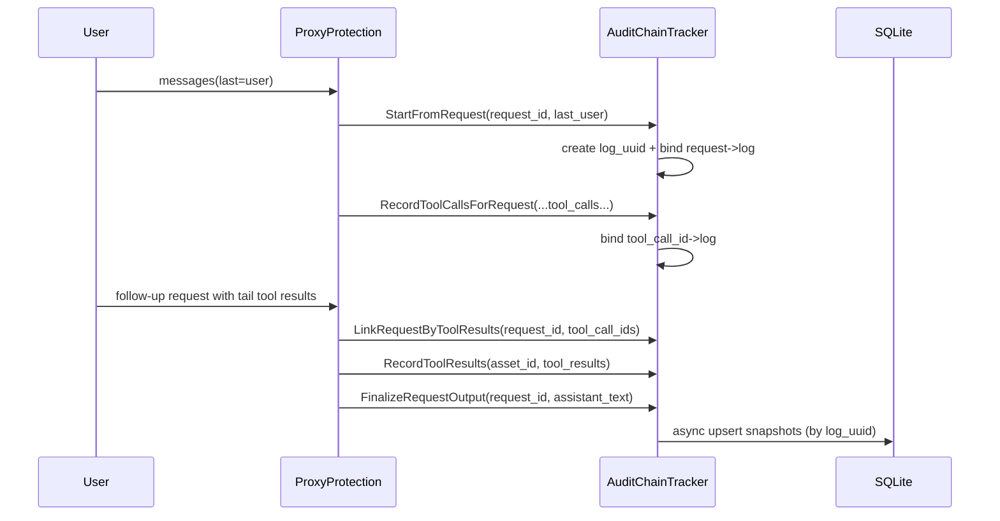
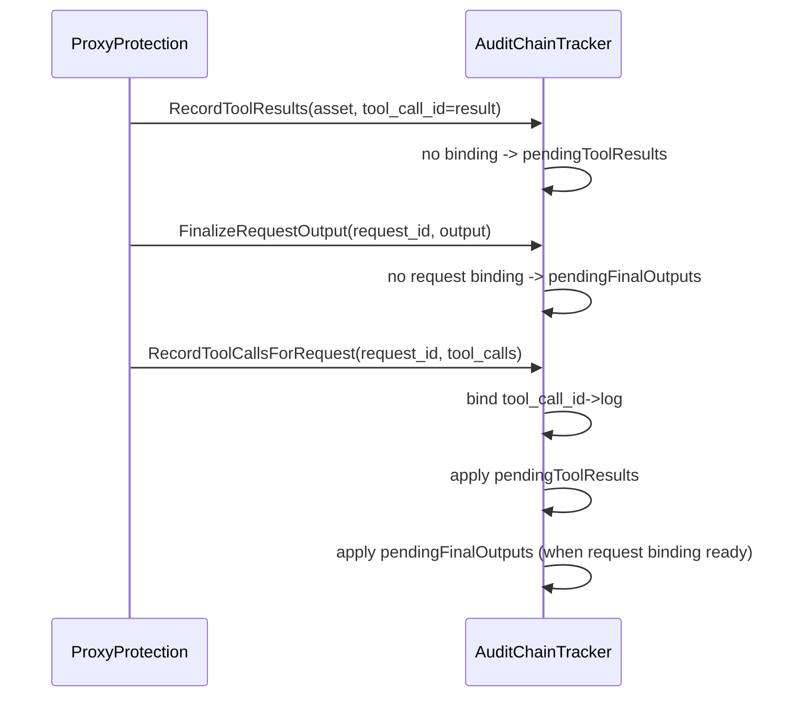

# 审计日志聚合技术实现方案（Audit Chain）

## 1. 目标与范围

本文档描述当前版本“审计日志聚合”在 Go/Flutter 全链路中的实际实现。

目标是将一次用户任务聚合为一条审计链：

- 起点：`messages` 最后一条是 `role=user`
- 中间：多次 `tool_call` / `tool_result`
- 终点：最终 assistant 非 tool_call 文本输出

并满足以下约束：

- 审计逻辑绝不阻断代理主流程（fail-open）
- 支持并发请求、乱序到达、流式输出
- 允许链路不完整（用户中断时无 tool_result / 无 final_output）
- 不维护任务 `status` 字段作为完成判定前提
- 不把 system prompt 作为 `request_content` 落库

## 2. 分层与调用链

当前实现包含两条语义清晰的链路：

1. 实时聚合链（Go 进程内）
- `ProxyProtection` -> `AuditChainTracker`（内存 SSOT）
- 负责关联、聚合、乱序修复、并发隔离

2. 持久化与查询链（SQLite）
- `AuditChainTracker` 快照异步入库 -> `repository.AuditLogRepository`
- Flutter 审计页面通过 `GetAuditLogsFFI` 读取 SQLite

说明：

- `GetAuditLogs/GetPendingAuditLogs`（proxy 内存快照接口）仍保留，主要用于监控/调试侧。
- 审计页面主数据源是 SQLite（`GetAuditLogsFFI`）。

## 3. 核心数据结构

### 3.1 内存审计实体

`go_lib/core/proxy/audit_log.go`

- `AuditLog`
  - `ID`: 链路唯一标识（即 `log_uuid`）
  - `RequestID`: 在 tracker 内为逻辑 request 关联键；落库时会被映射为 `ID`（兼容表结构）
  - `RequestContent`: 仅记录最后一条 user 指令
  - `ToolCalls[]`: 每个元素包含 `name/arguments/result/is_sensitive`
  - `OutputContent`: 最终 assistant 输出
  - `Action/Risk*`: 安全决策
  - `PromptTokens/CompletionTokens/TotalTokens/Duration`

- `auditLogState`
  - 包装 `AuditLog` 并维护内部索引：
  - `ToolSeq []string`、`ToolIndex map[string]int`（tool_call_id -> tool 下标）
  - `SortCursor`（快照序列，用于持久化防旧写覆盖）

### 3.2 关联索引与待定缓存

`AuditChainTracker` 内部维护：

- `requestToLog`: `request_id -> log_id`（TTL）
- `toolCallToLog`: `asset_id|tool_call_id -> log_id`（TTL）
- `pendingToolResults`: tool_result 先到、tool_call 绑定后到时的暂存
- `pendingRequestLinks`: request 先到、tool_call 绑定后到时的暂存
- `pendingFinalOutputs`: final output 先到、request 绑定后到时的暂存

TTL 常量：

- `auditRequestBindingTTL = 30m`
- `auditToolBindingTTL = 2h`

## 4. 请求生命周期聚合逻辑

## 4.1 起链：仅在“最后一条是 user”时创建新日志

入口：`ProxyProtection.onRequest` -> `tracker.StartFromRequest(...)`

`StartFromRequest` 规则：

- 从请求消息中提取最后一条 user：`extractLastUserInstruction`
- 若最后一条不是 user：跳过建链
- 若满足条件：
  - 创建 `log_id = audit_<timestamp>_<counter>`
  - `RequestContent = 最后 user 内容`
  - 初始化 `Action=ALLOW`
  - 建立 `request_id -> log_id` 绑定

这保证并发下“每个 user 指令都独立成链”，不会因为历史消息重复而合并。

## 4.2 request 与历史 tool_result 的关联（跨 HTTP 生命周期）

入口：`onRequest` 内：

- `collectTailToolResults(req.Messages)`
- `LinkRequestByToolResults(requestID, assetID, toolResults)`
- `RecordToolResults(assetID, toolResults)`

关键点：

- 只扫描“末尾连续的 tool 消息块”，不回扫整段历史（避免串链）
- 若能通过 `tool_call_id` 找到已有链路，立即把当前 request 绑定到该 `log_id`
- 找不到时将 `request_id + unresolved tool ids` 暂存到 `pendingRequestLinks`
- 对内嵌工具协议（如消息中 `<tool_result>`）会先被解析，再并入同一 `toolResults` 关联流程

## 4.3 tool_call 记录

来源分两类：

1. 非流式响应：`onResponse`
- 提取 `message.tool_calls`
- 调用 `RecordToolCallsForRequest`

2. 流式响应：`onStreamChunk`
- 增量合并 chunk tool_calls
- 每次有“新 ready 工具调用”时记录一次
- finish 时再做一次全量收口

`RecordToolCallsForRequest` 行为：

- 必须先通过 `request_id` 命中链路
- 每个 tool_call upsert 到 `ToolCalls[]`
- 建立 `tool_call_id -> log_id` 映射
- 若此前有 pendingToolResult，则立刻回填 result
- 若该 tool_call 能解开 pendingRequestLinks，也会反向补齐 request->log 绑定

## 4.4 tool_result 记录

入口：`RecordToolResults(assetID, toolResults)`

逻辑：

- 对每个 `tool_call_id`，先查 `toolCallToLog`
- 命中则更新对应 `ToolCalls[idx].Result`
- 未命中则缓存到 `pendingToolResults`

这样保证 tool_result 先到或后到都能最终关联。

## 4.5 终链：assistant 最终输出

入口：

- 非流式：`onResponse`（无 tool_calls 时）
- 流式：`onStreamChunk` finish（无 generatedToolCalls 时）

调用 `FinalizeRequestOutput(requestID, output)`：

- 若 request 已绑定 log：直接写 `OutputContent` + `Duration`
- 若 request 尚未绑定：写入 `pendingFinalOutputs`
- 后续一旦 `setRequestBindingLocked` 完成，会自动 `applyPendingFinalOutputLocked`

## 4.6 token 与风险决策

在 request 已绑定时更新：

- `UpdateRequestTokens(requestID, prompt, completion)`
- `SetRequestDecision(requestID, action, riskLevel, reason, confidence)`

包括配额拦截、沙箱阻断、ShepherdGate 判定等场景。

## 5. 并发与乱序安全设计

## 5.1 请求上下文绑定（避免并发串 request_id）

`go_lib/core/proxy/proxy_protection.go`

- `bindRequestContext(ctx, requestID)`：请求进入时绑定
- `requestIDFromContext(ctx)`：响应/流式阶段优先从 context 解 request_id
- `clearRequestContext(ctx)`：请求结束清理
- `requestContextBindingTTL = 2h`

这避免了“共享 currentRequestID 被后续请求抢占”的并发污染。

## 5.2 ID 归一化匹配

`normalizeAuditToolCallIDForMatch`：

- 去空白
- 只保留字母数字
- 转小写

用途：

- 兼容 provider 与 agent 在 `tool_call_id` 格式差异
- 统一 key：`asset_id|normalized_tool_call_id`

## 5.3 provider 未返回 tool_call_id 的补偿

- 非流式：`ensureResponseToolCallIDs`
- 流式：`StreamBuffer.MergeStreamToolCall` 按 index 生成稳定短 ID（`tc<base36>`）

并且在 chatmodel-routing 渲染响应时，会把“补齐后的 ID”回写到 raw JSON：

- `rewriteRawResponseToolCallIDs`
- `rewriteRawChunkToolCallIDs`

保证下游 agent 看到的 ID 与代理内部追踪 ID 一致。

## 5.4 过期清理

每次 tracker 操作都会先 `cleanupExpiredLocked(now)`，清理：

- request 绑定
- tool 绑定
- pendingToolResults
- pendingRequestLinks
- pendingFinalOutputs

## 6. 持久化策略（Go 层）

## 6.1 快照触发

任意会改动 `AuditLog` 的操作最后都会调用 `touchStateLocked`：

- `SortCursor++` 并写入 `PersistSeq`
- 追加到 `pending` 队列
- 异步入持久化队列

## 6.2 异步入库与防旧写覆盖

`auditLogPersistor`：

- 队列长度：`auditPersistQueueSize = 4096`
- `latestSeq[logID]` 记录最新快照序号
- 处理任务时若 `task.Seq < latestSeq[logID]`，直接丢弃（stale task）
- 持久化失败最多重试 3 次，且不阻断代理
- 队列满时走 fallback 异步单次处理

## 6.3 Repository 写入语义

`toRepositoryAuditLog` + `AuditLogRepository.SaveAuditLog`：

- 采用 `INSERT OR REPLACE`（按 `id` 幂等更新）
- `request_id` 列写入 `log_id`（仅为兼容历史 NOT NULL 约束）
- `messages` 当前仅写 user+assistant 摘要（非完整 message timeline）
- tool_calls 序列化为 JSON 字符串

## 7. Flutter 读写口径

## 7.1 持久化写入

- Flutter `syncPendingAuditLogs()` 现为 no-op
- 持久化完全由 Go 侧 tracker + persistor 完成

## 7.2 审计页读取

`AuditLogDatabaseService` -> `GetAuditLogsFFI/GetAuditLogCountFFI/...`（SQLite 查询）

支持：

- `risk_only`
- `asset_id`
- 时间范围
- 全文字段搜索（`request_content/output_content/risk_reason/tool_calls/messages`）

## 7.3 监控/调试读取

- `GetAuditLogs` / `GetPendingAuditLogs` 读取内存 tracker 快照
- `ClearAuditLogs` / `ClearAuditLogsWithFilter` 清理内存 tracker

## 8. 关键时序

## 8.1 正常链路

## 8.2 乱序链路（result/output 先到）

## 9. 异常与边界处理

- 用户中断：合法保留残缺链路（无 tool_result / 无 output）
- tool_call_id 为空：
  - 响应阶段尽量补齐短 ID
  - tool_result 空 ID 会被跳过
- 审计组件 panic：`auditLogSafe` recover，不影响主请求
- DB 暂不可用：持久化失败记录 warning，不阻断代理

## 10. 已落地测试覆盖（重点）

`go_lib/core/proxy/`：

- `audit_log_tracker_test.go`
  - last user 起链
  - request/tool/result 关联
  - 乱序恢复（result 先到、final 先到）
  - ID 归一化匹配
  - partial match 场景

- `proxy_protection_handler_tokens_test.go`
  - context 绑定 request_id 并发安全
  - 缺失 tool_call_id 自动注入与稳定性

- `proxy_protection_handler_request_test.go`
  - tail tool block 提取
  - last user 当前轮提取

- `audit_log_persist_test.go`
  - PersistSeq 递增与防旧写

- `audit_log_persist_integration_test.go`
  - tracker -> SQLite 入库链路

- `chatmodel-routing/proxy_response_render_test.go`
  - raw non-stream/stream 响应 tool_call_id 回写一致性

## 11. 调试建议（按日志关键字）

排查时优先 grep：

- `[AuditChain] start created`
- `[AuditChain] bind request->log`
- `[AuditChain] bind tool_call_id->log`
- `[AuditChain] record tool_result pending|matched`
- `[AuditChain] finalize assistant output pending|matched`
- `[AuditLog] Skip stale persist task`

可快速定位链路是否断在“request 绑定 / tool 绑定 / final 回填 / 持久化”哪一层。

## 12. 当前实现口径总结

- 链路身份：`log_uuid`（`audit_logs.id`）
- `request_id`：仅作为运行时关联键；落库列为兼容用途
- 审计聚合主实现：Go `AuditChainTracker`
- 落库：Go 异步直接写 repository
- 前端：审计页只读 SQLite，不再负责把内存缓冲写库
